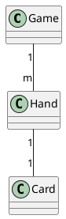

# iceye-home-work

Homework of ICEYE for the job application process

## How to run the app

### On Docker
if you have make tools installed, you can run with `make` - command. If not, try to run this: `docker build -t larvis . && docker run -i larvis:latest`.

### Locally
Again, with having maketools, you can call `make local-run`. Without them `go build . && go run .`. Then you need to have instlled `go` on your machine.

## Project structure

The app is trying to follow this code structure:
https://github.com/golang-standards/project-layout

Key points of this project

- [root] - app specific files, main.go, root_config.go
- internal - all the domains, a.k.a. business logic
- pkg - "public" code. it contains mostly utility functions.

The project is also trying to respect domain driven design. There are more about the domains later.

### Justifications

#### Why DDD?

- It keeps code clean and makes app scale easier. It's not perfect, and even a bit overkill for small application like this, but the purpose is to demonstrate my abilities to use DDD. DDD allows to add/remove domains easily. It also causes that changes in a domain, will most likely have minimal or no effect on other domains.

#### Why configs are stored in json?

- There is built in support for JSON, so with that I did not need to use external libraries.

#### Why no database?

- I did not see any justification to add a DB. The configurations could have stored in DB. However they are needed to store in the repo in order to run the app. Even with the DB you would have needed to seed the DB. Therefore, for this version DB is not needed. It could be added on version 2.

#### Testing

- There are no unit tests. I actually had before, but decided to remove them. Instead of unit tests, I have one integration test, that tests ~half the components. However the test is table driven with large data set. The integration test tests better than the isolated tests. There are some edge cases that might be missed out, but even then I think an anohter integration or e2e would catch the edge case better. 

## Domains

- [root] (main) - the required logic to set things up
- game - logic related to the game itself
- hand - holds the cards
- calc - calculation logic related to the scoring of the hand
- card - A single component where the hands are composed

### Domain relationships:
There are relationships in order to keep domains isolated. 

Having the relationships means, that only respective references are allowed done in the code:

- Game can refer Actor (or Dealer)
- Actor, Non-Dealer can refer Hand
  - Dealer can refer Deck
- Deck/Hand can refer Card
