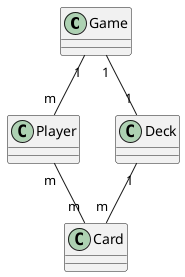

# iceye-home-work

Homework of ICYEYE for the job application process

## How to run the app

if you have make tools installed, you can run with `make` - command. If not, try to run this: `docker build -t larvis . && docker run larvis:latest`.

## Decisions / Comments

### Project structure

The app is trying to follow this code structure:
https://github.com/golang-standards/project-layout

The project is also trying to respect domain driven design.

#### Domains

- [root] (main)
- game
- player
- deck
- card

Domain relationships:

