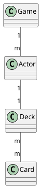

# iceye-home-work

Homework of ICYEYE for the job application process

## How to run the app

if you have make tools installed, you can run with `make` - command. If not, try to run this: `docker build -t larvis . && docker run larvis:latest`.

## Decisions / Comments

### Project structure

The app is trying to follow this code structure:
https://github.com/golang-standards/project-layout

The project is also trying to respect domain driven design.

#### Domains

- [root] (main)
- game
- actor|dealer
- deck|hand
- card

Notes:
- Dealer is a special type of Actor
- Hand is a special type of Deck

Domain relationships:

Having the relationships means, that only respective references are allowed done in the code:

- Game can refer Actor (or Dealer)
- Actor, Non-Dealer can refer Hand 
    - Dealer can refer Deck
- Deck/Hand can refer Card