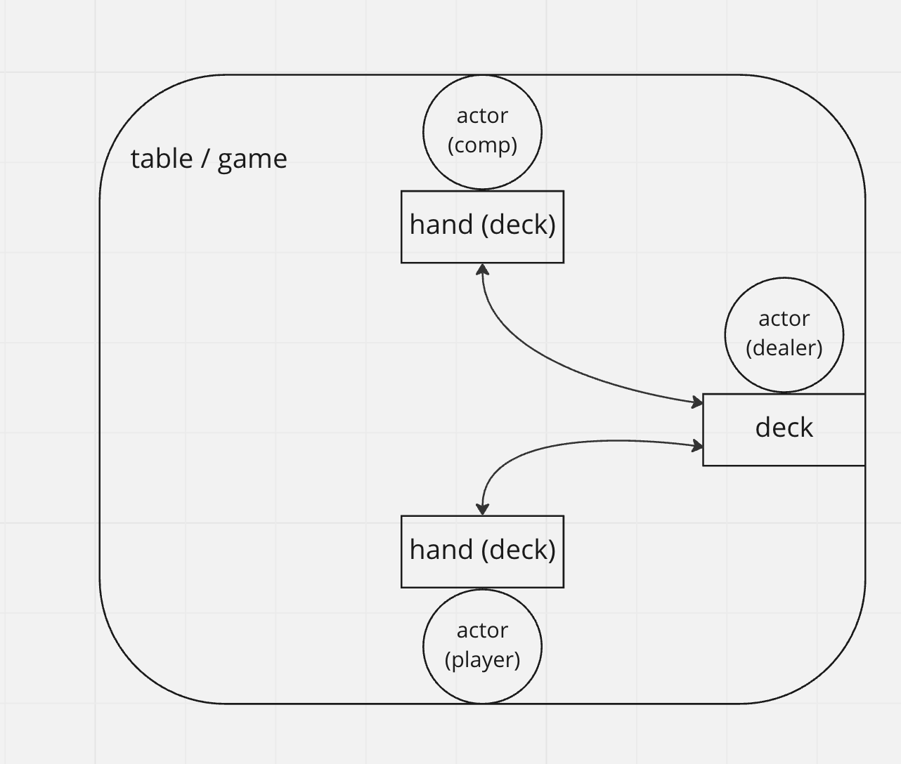

# iceye-home-work

Homework of ICEYE for the job application process

## How to run the app

if you have make tools installed, you can run with `make` - command. If not, try to run this: `docker build -t larvis . && docker run larvis:latest`.

## Used tools
 - [Air](https://github.com/cosmtrek/air) - to improve development speed. 
It is used to reload files, and only configured locally. Therefore it's not inside the docker, but there are configuration files `.zshrc`and `air.toml` in the repo.

## Project structure

The app is trying to follow this code structure:
https://github.com/golang-standards/project-layout

Key points of this project
 - [root] - app specific files, main.go, root_config.go
 - internal - all the domains, a.k.a. business logic
 - pkg - "public" code. it contains mostly utility functions.

The project is also trying to respect domain driven design. There are more about the domains later.

### Justifications
#### Why DDD?
 - It keeps code clean and makes app scale easier. It's not perfect, and even a bit overkill for small application like this, but the purpose is to demonstrate my abilities to use DDD.
 
 #### Why configs are stored in json?
  - There is built in support for JSON, so with that I did not need to use external libraries.
 
 
 #### Why no database? 
  - I did not see any justification to add a DB. The configurations could have stored in DB. However they are needed to store in the repo in order to run the app. Even with the DB you would have needed to seed the DB. Therefore, for this version DB is not needed. It could be added on version 2.
  
 #### Testing
  - There are very few unit tests. I aimed to test atleast the most "business" critical code lines. Having much higher test coverage would increase time spent, and sadly I do not have that much time available.
  - In terms of testing, I would add tests for most methods inside inside `internal` - package, they contain practically all the business logic.
  - I would also consider adding e2e or integration test(s) to make sure everything works together. I think having atleast one is more important than having many unit tests.

## Domains

- [root] (main) - the required logic to set things up
- game - logic related to the game itself
- actor|dealer - the player, the one who has the cards, but also the dealer
- deck|hand - holds the cards of an Actor.
- card - A single component where the decks are composed

### Notes:
- Dealer is a special type of Actor
- Hand is a special type of Deck

### Visualization

### Domain relationships:

Having the relationships means, that only respective references are allowed done in the code:

- Game can refer Actor (or Dealer)
- Actor, Non-Dealer can refer Hand 
    - Dealer can refer Deck
- Deck/Hand can refer Card

